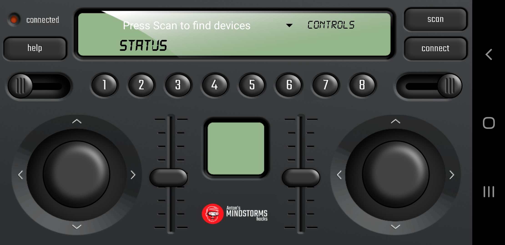

# MINDSTORMS Python Remote control over BLE

This repository contains python scripts that go with the free [MINDSTORMS Remote BLE App](https://play.google.com/store/apps/details?id=com.antonsmindstorms.mindstormsrc&hl=nl&gl=US). The Android App is written using http://kodular.io.

## Usage 
To use the scripts copy and paste them into a new Python project inside a LEGO app. You can use either the MINDSTORMS Robot Inventor App or the SPIKE Prime app.

## Todo
- Refactor the script, it's not pretty but it works.
- Add more comments
- Expand the documentation
- Add more examples for different robots.
- Create a library you can import on the LEGO hubs, so the scripts become even cleaner

## Protocol

### Sending
The remote control sends its control data in a structure:

|bytes | format | specification | range |
|------|--------|---------------|-------|
| 1 | b | l_stick_hor | -100..100 |
| 1 | b | l_stick_ver | -100..100 |
| 1 | b | r_stick_hor | -100..100 |
| 1 | b | r_stick_ver | -100..100 |
| 1 | B | l_trigger | 0..200|
| 1 | B | r_trigger | 0..200 |
| 2 | h | l_slider | -360..360 |
| 2 | h | r_slider | -360..360 |
| 1 | B | button bits | 1 << (button-1) |

This corresponds to the following Python structure:

`Transmit struct.pack('bbbbBBhhB', l_stick_hor,l_stick_ver,r_stick_hor,r_stick_ver,l_trigger,r_trigger,l_slider,r_slider,buttons)`

### Receiving
The remote control receives a number of messages using the following structure:

| command | description | example |
|---------|-------------|---------|
|`Image` | displays a SPIKE/Mindstorms image on small LCD display | `Image('35790:00000:00000:00000:00000')`|
|`T<text>` | displays test `<text>` in the status line of the LCD display | `THello World` |
|`S<text>` | Uses text-to-speech (english) to convert `<text>` to speech| `SWall detected` |
|`L<value>` | Sets left slider on value `<value>`| `L100` |
|`R<value>` | Sets rightt slider on value `<value>`| `R100` |

## Authors
Anton's Mindstorms 
Ste7an